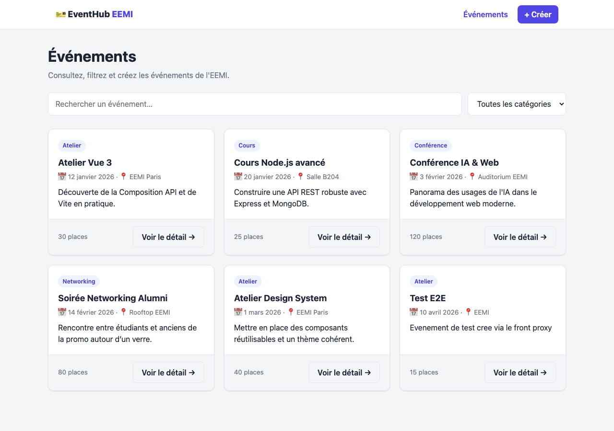
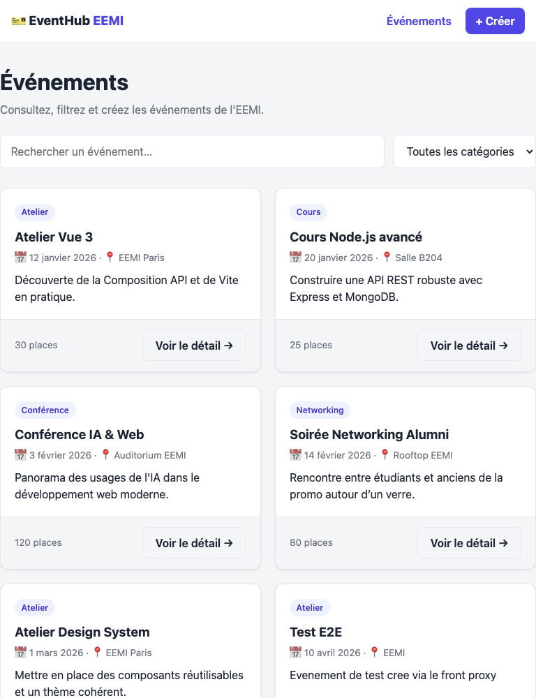
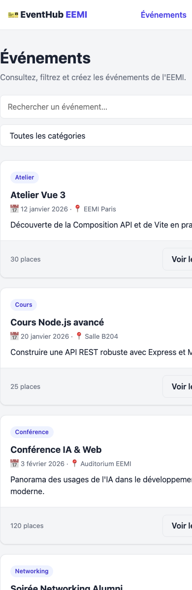
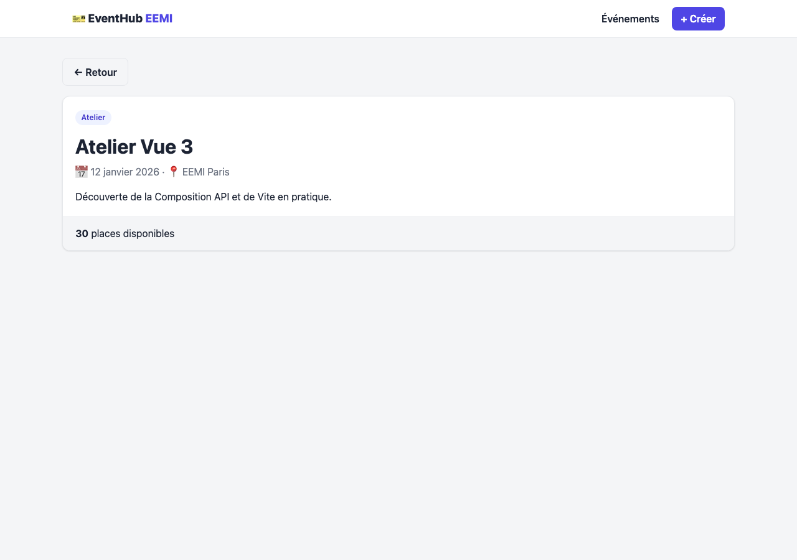
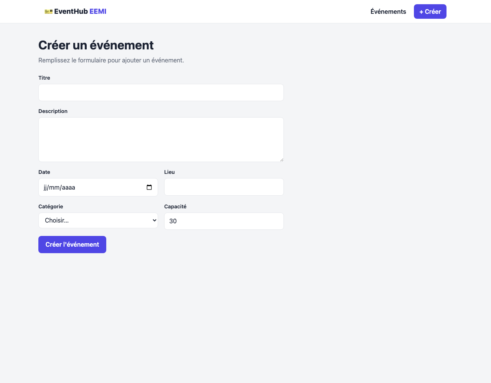

# EventHub EEMI — Frontend Vue 3

Interface web de gestion d'événements développée en **Vue 3 + Vite** (Composition API, `<script setup>`, Vue Router, Pinia). Elle permet de **consulter, filtrer, afficher en détail et créer** des événements.

Le projet contient aussi l'**API Node.js** (Express + MongoDB) dans le dossier `server/`, consommée par le front. Le contrat API est identique au sujet Node.js EventHub.

- **Mode utilisé : API Node.js réelle** (dossier `server/`, Express + MongoDB), pas de mock JSON.

---

## Installation & lancement

Le projet a deux parties : l'**API** (`server/`) et le **front** (racine). Il faut lancer les deux.

### Prérequis
- Node.js 18+
- MongoDB lancé en local (`mongodb://127.0.0.1:27017`)

### 1. Backend (API)

```bash
cd server
npm install
cp .env.example .env      # PORT=4000, MONGO_URI=...
npm run seed              # insère 5 événements de démo (optionnel)
npm run dev               # API sur http://localhost:4000
```

### 2. Frontend (Vue)

Dans un second terminal, à la racine du projet :

```bash
npm install
npm run dev               # front sur http://localhost:5173
```

Le front appelle `/api/...` ; en dev, **Vite proxifie ces requêtes vers l'API Node** (`http://localhost:4000`), donc aucun souci de CORS. Ouvrir ensuite **http://localhost:5173**.

### Build de production

```bash
npm run build             # génère dist/
npm run preview
```

---

## Structure du projet

```
partiel_vuejs/
├── index.html            # point d'entrée HTML
├── vite.config.js        # config Vite + proxy /api → :4000
├── src/
│   ├── main.js           # création de l'app, branchement router + Pinia
│   ├── App.vue           # composant racine (Navbar + RouterView)
│   ├── router/           # routes Vue Router
│   ├── stores/           # store Pinia (events : liste, loading, erreurs, filtres)
│   ├── services/         # couche d'accès à l'API (fetch)
│   ├── constants.js      # catégories + helpers (dates, libellés)
│   ├── components/       # composants réutilisables
│   │   ├── Navbar.vue
│   │   ├── EventCard.vue
│   │   ├── EventForm.vue
│   │   ├── SearchBar.vue
│   │   ├── BaseButton.vue
│   │   └── BaseCard.vue  # composant générique avec slots
│   └── views/            # pages liées aux routes
│       ├── HomeView.vue          # /        (liste + recherche + filtre)
│       ├── EventDetailView.vue   # /events/:id
│       ├── CreateEventView.vue   # /create
│       └── NotFoundView.vue      # 404
└── server/               # API Node.js (Express + MongoDB)
```

### Pages (Vue Router)
- `/` — dashboard : liste des événements, recherche et filtre par catégorie
- `/events/:id` — détail d'un événement
- `/create` — formulaire de création

### Contrat API consommé
- `GET /api/events` — liste des événements
- `GET /api/events/:id` — détail d'un événement
- `POST /api/events` — création d'un événement

Format d'un événement :
```json
{ "_id": "...", "title": "Atelier Vue", "description": "...", "date": "2026-01-12",
  "location": "EEMI", "category": "atelier", "capacity": 30 }
```
Catégories autorisées : `cours`, `atelier`, `conference`, `networking`.

> Remarque : l'authentification JWT du sujet Node a été retirée sur `POST /api/events` pour que la création fonctionne sans login.

---

## Captures d'écran

| Desktop | Tablette | Mobile |
|---|---|---|
|  |  |  |

| Détail d'un événement | Formulaire de création |
|---|---|
|  |  |

---

## Partie théorique

Les réponses aux questions théoriques (Q1 à Q4) se trouvent dans le fichier [`reponses.txt`](reponses.txt).

---

## Points techniques (fonctionnalités demandées)

- **Vue 3 + Vite + Composition API** avec `<script setup>` sur tous les composants.
- **v-model** : recherche et champs du formulaire ; **v-for** : liste des événements ; **v-if / v-else-if / v-else** : états loading / erreur / vide ; **@click** : navigation, réessai, suppression de filtre.
- **props** : l'événement descend du parent vers `EventCard` ; **emits** : `EventCard` remonte l'événement sélectionné (`select`), `EventForm` remonte les données (`submit`).
- **slots** : `BaseCard` (slot par défaut + slot `footer`) et `BaseButton`.
- **Pinia** : store `events` qui gère la liste, le `loading` et les `error`.
- **computed** : `filteredEvents` filtre par recherche et catégorie de manière réactive.
- **Design responsive** : grille 1 / 2 / 3 colonnes selon mobile / tablette / desktop.
